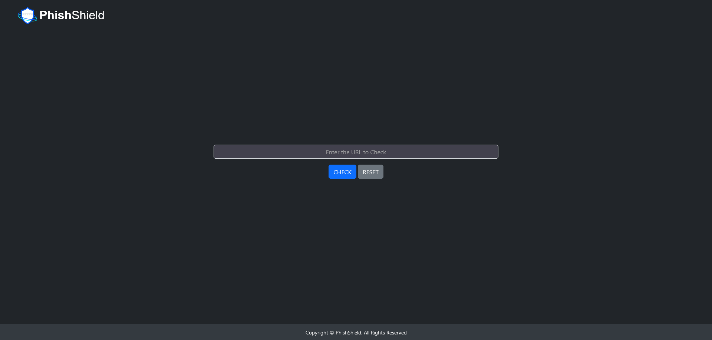
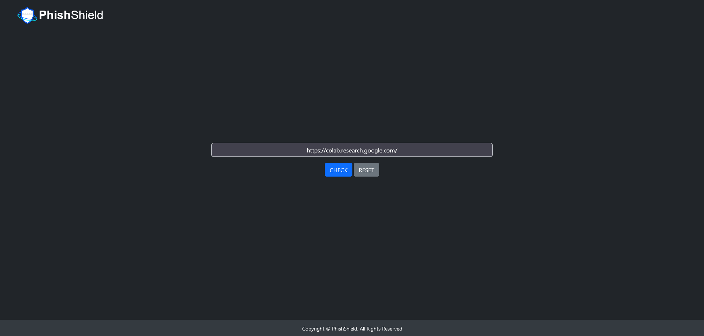
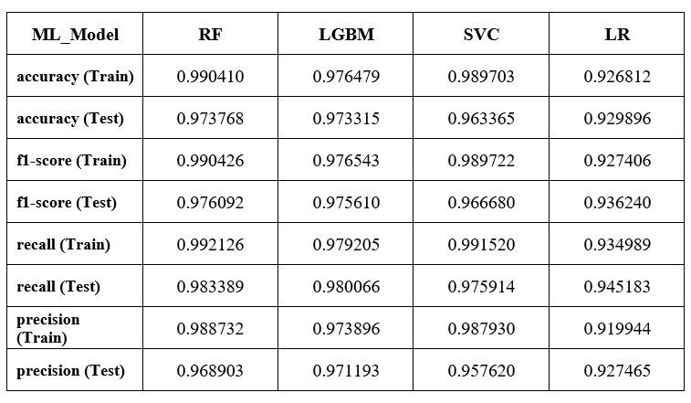
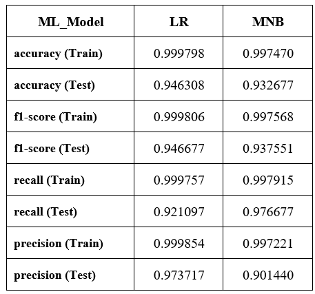

# PhishShield

PhishShield is a machine learning-powered project developed by Sai Vardhan NP to detect phishing websites using both feature-based and text-based models. This repository provides a comprehensive solution, including dataset details, model training, Flask-based deployment, and a user-friendly web interface.

## Table of Contents

- [Datasets](#datasets)
- [Machine Learning Models](#machine-learning-models)
- [Flask Deployment with Caching](#flask-deployment-with-caching)
- [Webpage Interface](#webpage-interface)
- [Usage](#usage)
- [Results](#results)
- [Contributing](#contributing)

## Datasets

PhishShield, created by Sai Vardhan NP, leverages two distinct datasets tailored for training its machine learning models.

### Dataset for Feature-based Model

- [Phishing Website Detector Dataset](https://www.kaggle.com/datasets/eswarchandt/phishing-website-detector): Used to train the feature-based model with 29 URL features.

### Dataset for Text-based Model

- [Phishing and Legitimate URLs Dataset](https://www.kaggle.com/datasets/harisudhan411/phishing-and-legitimate-urls): Used to train the text-based model by analyzing URL text content.

## Machine Learning Models

PhishShield, developed by Sai Vardhan NP, incorporates two machine learning models built with Python and scikit-learn:

### Feature-based Model

This model employs a supervised learning approach, utilizing 29 URL features to classify websites as phishing or legitimate. It leverages scikit-learn pipelines with custom transformers for data preprocessing and grid search with cross-validation for hyperparameter tuning.

### Text-based Model

This model analyzes the text content of URLs, extracting relevant features to train a classifier for phishing detection. It also uses scikit-learn pipelines and grid search for optimal performance.

Both models are evaluated using metrics such as accuracy, precision, recall, and F1-score to ensure robust detection of phishing websites.

## Flask Deployment with Caching

Sai Vardhan NP has deployed both models using Flask, a lightweight Python web framework. The Flask application exposes endpoints for real-time predictions, with disk-based caching to enhance performance by storing results of prior predictions.

## Webpage Interface

The web interface, designed by Sai Vardhan NP, is built with HTML, CSS, and Bootstrap for a seamless user experience. Users can input a URL to receive predictions on whether it is a phishing website.

<div align="center">
    
    
</div>

## Usage

To use PhishShield, developed by Sai Vardhan NP, follow these steps:

1. Clone the repository:

   ```
   git clone --depth=1 https://github.com/SaiVardhanNP/PhishShield.git
   ```

2. Install the required dependencies:

   ```
   pip install -r requirements.txt
   ```

3. Configure the `.env` file with your [reCAPTCHA Keys](https://developers.google.com/recaptcha/intro) and Flask Secret Key. To generate a Flask Secret Key, run:

   ```
   python -c 'import secrets; print(secrets.token_hex(16))'
   ```

   Copy the generated key into the `.env` file.

4. Start the Flask application:

   ```
   python app.py
   ```

5. Access the web interface at `http://127.0.0.1:5000` in your browser.

## Results

The performance of PhishShield's models, developed by Sai Vardhan NP, is measured using accuracy, precision, recall, and F1-score, demonstrating their effectiveness in identifying phishing websites.

### Feature-based Model

<div align="center">
    
</div>

### Text-based Model

<div align="center">
    
</div>

## Contributing

Contributions to PhishShield, created by Sai Vardhan NP, are welcome! If you have suggestions for improvements or new features, please open an issue or submit a pull request.


